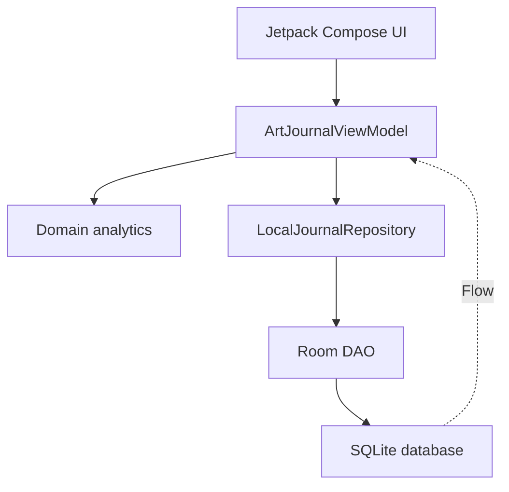
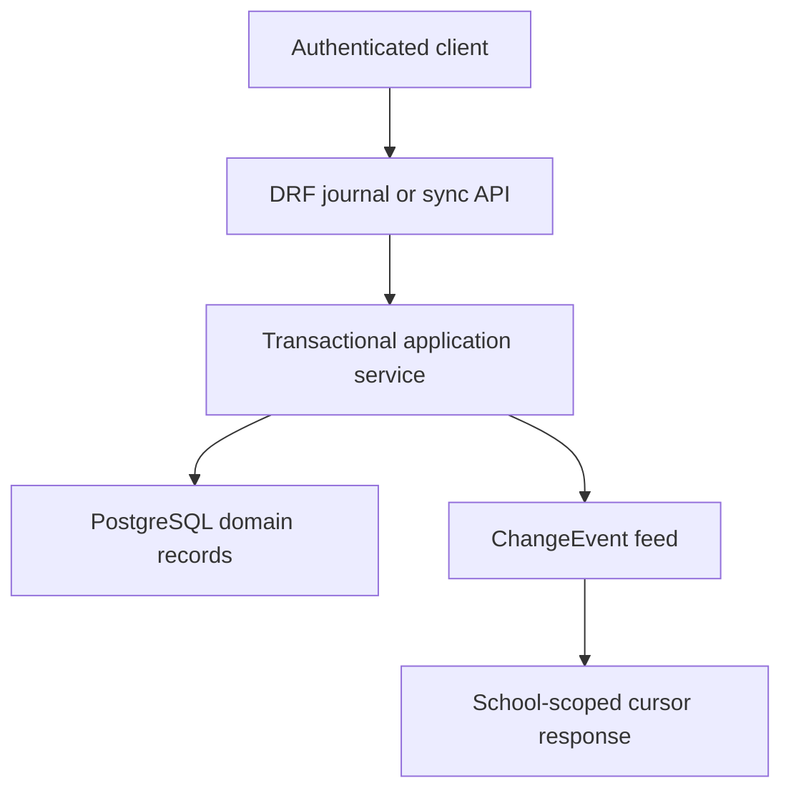

<div align="center">


# Art Journal

**An Android application and Django REST backend for managing an art school's teaching workflow**


[](https://github.com/ajuia-m/artjournal/actions/workflows/android-ci.yml)
[](https://github.com/ajuia-m/artjournal/actions/workflows/backend-ci.yml)

**English · [Русский](README.ru.md)**

</div>

## Project status

Art Journal contains a local legacy journal, an Android server-workspace
bootstrap and a Django backend:

- `Local legacy` remains a single-user Room/SQLite journal with ten entity
  types and no server data mixed into its database;
- `Server workspace` now supports JWT login, encrypted refresh-token
  persistence, access-token rotation, session restoration and explicit school
  selection;
- the Django/DRF backend provides PostgreSQL persistence, schools, memberships,
  teacher assignments, a protected journal API, a safe JSON v1 importer and the
  first offline synchronization slice for student lesson states.

The first Android/backend connection is deliberately limited to authentication
and workspace selection. Server-backed journal reads, a UUID Room replica,
outbox, WorkManager and conflict UI are not implemented yet.

The planned server-backed mode is server-authoritative while still allowing
supported offline writes. A future Room replica will store an atomic outbox;
WorkManager will resend stable commands after connectivity returns. The backend
already deduplicates commands, checks record versions, emits tombstones and
serves a cursor-based change feed for `StudentLessonState`.

The integration boundary is specified in
[ADR-0002](docs/adr/0002-android-server-integration.md), and the offline command
protocol is specified in
[ADR-0003](docs/adr/0003-offline-write-synchronization.md).

## Implemented functionality

### Android application

| Screen | Component | Current functionality |
|---|---|---|
| Workspace | `ServerWorkspaceScreen` | Separate local/server modes, JWT login, session restoration and school selection |
| Journal | `JournalScreen` | Student/lesson table, grades `0–5`, attendance, homework points, notes and PDF export |
| Topics | `ThemesScreen` | Assessed topics, criteria, maximum scores and individual progress `0–100%` |
| Calendar | `ScheduleScreen` | Academic years, periods, holidays, subjects and weekly group schedules |
| Analytics | `TrackerScreen` | Student comparison by subject, homework and attendance |
| Settings | `SettingsScreen` | Archive, demo data, action log, JSON backup and legacy CSV clipboard exchange |

`MainActivity` first selects an isolated workspace. Local mode owns one
`ArtJournalViewModel` and switches the five journal screens with `Crossfade`.
Server mode uses a separate `ServerWorkspaceViewModel` and session repository.
Navigation Compose is not used. Domain analytics remain separated from the
ViewModel and covered by deterministic JVM tests.

### Backend

- Django 5.2.16, Django REST Framework and PostgreSQL 17;
- custom UUID user model;
- JWT access/refresh lifecycle with refresh rotation and blacklist;
- schools and active memberships with `admin` and `teacher` roles;
- subject-specific and group-wide teaching assignments;
- protected lesson and student lesson state endpoints;
- ordered many-to-many links between lessons and topics;
- OpenAPI 3.0.3 schema and Swagger UI;
- transactional JSON v1 import with JSON Schema validation, dry run, SHA-256,
  `ImportBatch`, legacy ID mapping and isolated legacy audit entries;
- sync protocol v1 for `StudentLessonState`, including idempotent command
  processing, optimistic concurrency, tombstones and a filtered change feed;
- Docker Compose development stack, readiness check, Pytest and Ruff.

Backend setup and endpoint examples are documented in the
[backend README](backend/README.md).

## Current architecture

### Android local legacy mode



`ArtJournalApplication` creates a manual `AppContainer`.
`ArtJournalViewModelFactory` injects the local repository and backup exporter,
so Compose code does not construct Room or access DAO objects directly.

### Backend write and synchronization path



REST and sync writes for student lesson states share the same service. A state
change and its `ChangeEvent` are committed in the same transaction. Teachers
only receive events for groups and subjects covered by their active assignment.

## Data models

The local Room v2 database contains:

| Table | Kotlin entity | Purpose |
|---|---|---|
| `academic_years` | `AcademicYear` | Academic year, active flag and holidays |
| `groups` | `Group` | Group, subjects and weekly schedule |
| `students` | `Student` | Student record, status and contract metadata |
| `payments` | `Payment` | Tuition payment history |
| `quarters` | `Quarter` | Academic periods and date boundaries |
| `lessons` | `Lesson` | Date, group, subject and lesson topic |
| `student_lesson_states` | `StudentLessonState` | Attendance, grade, homework and notes |
| `topics` | `Topic` | Assessed topic, criteria and assignments |
| `student_topic_progress` | `StudentTopicProgress` | Per-student topic progress and criterion scores |
| `audit_logs` | `AuditLog` | Recent local actions and partial undo data |

This is a legacy prototype schema: relationships use integer IDs without Room
foreign keys, several collections are encoded as strings, and some invariants
exist only in UI/ViewModel code. See the
[exact current Room model](docs/data-model-current.md).

The normalized server model uses UUIDs, foreign keys, constraints and separate
entities for enrollments, subjects, schedules, topic criteria and lesson-topic
links. See the [server data model](docs/server-data-model.md).

## Technology stack

### Android

| Technology | Repository version | Use |
|---|---:|---|
| Kotlin | `2.2.10` | Application language |
| Android Gradle Plugin | `9.1.1` | Android build |
| Gradle Wrapper | `9.3.1` | Reproducible build with distribution checksum |
| Jetpack Compose BOM | `2024.09.00` | UI and Material 3 |
| Activity Compose | `1.10.1` | Compose host |
| Lifecycle | `2.8.7` | ViewModel, runtime and Compose integration |
| Room | `2.7.0` | Local SQLite database |
| Coroutines | `1.10.2` | Asynchronous work and streams |
| KSP | `2.3.5` | Room and Moshi code generation |
| Retrofit | `2.12.0` | JWT, account and school API client |
| Moshi | `1.15.2` | Generated network DTO adapters |
| OkHttp | `4.10.0` | Bearer-token interceptor, refresh authenticator and transport |
| JUnit | `4.13.2` | JVM unit tests |
| Robolectric | `4.16.1` | Android JVM tests |
| Roborazzi | `1.59.0` | Screenshot tests |

Android configuration: application ID and namespace
`com.ajuia.artjournal`, minimum SDK 24, target SDK 36, compile SDK 36.1,
version `1.0` (`versionCode = 1`), Java compatibility 11 and JDK 17 for Gradle.

### Backend

| Technology | Repository version | Use |
|---|---:|---|
| Python | `3.13` in CI and container | Runtime |
| Django | `5.2.16` | Web application and ORM |
| Django REST Framework | `3.17.1` | HTTP API |
| Simple JWT | `5.5.1` | JWT lifecycle and blacklist |
| drf-spectacular | `0.30.0` | OpenAPI 3.0.3 and Swagger UI |
| PostgreSQL | `17-alpine` | Production-shaped database in Compose and CI |
| Psycopg | `3.3.4` | PostgreSQL driver |
| Gunicorn | `26.0.0` | Container application server |
| JSON Schema | `4.25.1` | Backup and sync contract validation |
| Pytest | `9.1.1` | Backend tests |
| pytest-django | `4.12.0` | Django test integration |
| Ruff | `0.16.0` | Lint and formatting checks |

## Repository layout

```text
artjournal/
├── .github/workflows/          # Android and backend CI
├── app/                        # Kotlin/Compose Android application
│   ├── schemas/                # Committed Room schema v2
│   └── src/
│       ├── main/
│       ├── test/
│       └── androidTest/
├── backend/                    # Django/DRF application
│   ├── apps/                   # Domain Django apps and tests
│   ├── config/                 # Settings and URL configuration
│   ├── requirements/
│   ├── Dockerfile
│   └── README.md
├── docs/                       # ADRs, contracts and data-model documentation
│   ├── adr/
│   ├── examples/
│   └── schemas/
├── gradle/                     # Version catalog and verified wrapper
├── compose.yaml                # Django + PostgreSQL development stack
├── README.md                   # Main English overview
└── README.ru.md                # Russian overview
```

## Run the Android application

### Requirements

- Android Studio compatible with Android Gradle Plugin `9.1.1`;
- JDK 17 as the Gradle JDK;
- Android SDK 36.1;
- an emulator or physical device running Android 7.0 or newer.

Clone the repository and open its root directory in Android Studio:

```bash
git clone https://github.com/ajuia-m/artjournal.git
cd artjournal
```

Use the committed Gradle Wrapper. It pins Gradle `9.3.1` and verifies the
download with `distributionSha256Sum`.

Select the `app` run configuration and start a device, or build from the
terminal:

```bash
./gradlew assembleDebug
```

The debug build uses Android's standard debug signing. No project-level debug
keystore or API key is required.

`Server workspace` uses `http://10.0.2.2:8000/` by default, which reaches a
backend running on the emulator host. Override the build-time URL for another
HTTPS environment:

```bash
./gradlew assembleDebug -PARTJOURNAL_API_BASE_URL=https://api.example.test/
```

The URL must end with `/`. Cleartext traffic is denied except for the Android
emulator development hosts `10.0.2.2` and `localhost`.

### Release build

The release configuration expects an upload keystore and the following
environment variables:

```bash
export KEYSTORE_PATH=/absolute/path/to/my-upload-key.jks
export STORE_PASSWORD=your_store_password
export KEY_PASSWORD=your_key_password
./gradlew assembleRelease
```

The configured key alias is `upload`.

## Run the backend

Docker Compose is the recommended development path:

```bash
cp .env.example .env
docker compose up --build
```

Compose starts PostgreSQL, waits for it to become healthy, applies Django
migrations and exposes the server at `http://localhost:8000`.

| URL | Purpose |
|---|---|
| `http://localhost:8000/api/v1/health/` | Database-backed readiness check |
| `http://localhost:8000/api/v1/docs/` | Swagger UI |
| `http://localhost:8000/api/v1/schema/` | OpenAPI schema |
| `http://localhost:8000/admin/` | Django Admin bootstrap interface |

Stop the stack without deleting the database:

```bash
docker compose down
```

`docker compose down --volumes` also deletes the local PostgreSQL volume and
must only be used when losing development data is acceptable.

For SQLite-based local checks without Docker, see the
[backend README](backend/README.md#локальный-запуск-без-docker).

## API overview

All protected endpoints use Bearer JWT. Roles are not trusted from token
claims: active memberships and teacher assignments are read from the database
for each protected request.

| Area | Endpoint |
|---|---|
| JWT login | `POST /api/v1/auth/token/` |
| JWT refresh/logout | `POST /api/v1/auth/token/refresh/`, `POST /api/v1/auth/token/logout/` |
| Current user | `GET /api/v1/auth/me/` |
| Accessible schools | `GET /api/v1/schools/` |
| Memberships | `/api/v1/schools/{schoolId}/memberships/` |
| Teaching assignments | `/api/v1/schools/{schoolId}/teaching-assignments/` |
| Lessons | `/api/v1/schools/{schoolId}/groups/{groupId}/lessons/` |
| Student lesson states | `.../lessons/{lessonId}/states/` |
| Offline commands | `POST /api/v1/schools/{schoolId}/sync/commands/` |
| Change feed | `GET /api/v1/schools/{schoolId}/sync/changes/?cursor=...` |

The sync API currently supports only `student_lesson_state`. Snapshot recovery,
lesson synchronization, progress/criterion synchronization and retention are
not implemented yet.

## Import and export

- `ArtJournalBackupExporter` writes all ten Room tables as a transactional,
  versioned [Art Journal JSON v1 backup](docs/backup-format-v1.md) through the
  Android system document picker;
- the backend validates JSON v1 by JSON Schema and domain rules and imports it
  transactionally through `import_artjournal_backup` with `--dry-run` support;
- repeated bytes with the same `exportId` and SHA-256 are idempotent;
- a new export from the same Room database has a new `exportId`, so v1 cannot
  prevent semantic duplicates between different exports;
- JSON restore in Android and a protected HTTP import endpoint are not
  implemented yet;
- legacy CSV exchange is incomplete and must not be treated as a full backup;
- PDF export currently writes directly to the public Downloads directory and
  is limited to a single page of up to twelve lessons.

Backups may contain names, birth dates, attendance, grades, contracts, notes and
payment history. Do not commit real backups, attach them to public issues or
store them in CI artifacts.

## Tests and CI

Run the Android checks:

```bash
./gradlew testDebugUnitTest
./gradlew lintDebug assembleDebug
./gradlew pixel2api30DebugAndroidTest \
  -Pandroid.testoptions.manageddevices.emulator.gpu=swiftshader_indirect
```

Run backend checks from `backend/` after installing `requirements/dev.txt`:

```bash
ruff check .
ruff format --check .
python manage.py check
python manage.py makemigrations --check --dry-run
python manage.py spectacular \
  --file /tmp/artjournal-openapi.yaml \
  --validate --fail-on-warn
pytest
```

Android CI runs JVM and MockWebServer tests, Robolectric, lint, a debug build,
Room schema verification and a Compose smoke test on a managed Pixel 2/API 30
emulator.
Backend CI runs Ruff, Django checks, migration drift detection, OpenAPI
validation, Pytest, Docker Compose validation, a real PostgreSQL-backed stack
and the health endpoint.

## Roadmap

Statuses describe code already merged into `main`: **✅ completed**,
**○ planned**.

### Local Android foundation

- ✅ Verified Gradle Wrapper and reproducible CI build.
- ✅ Room schema v2 export and CI drift check.
- ✅ Transactional, versioned JSON v1 export of all ten Room tables.
- ✅ Repository boundary, manual dependency injection and domain analytics tests.
- ✅ Managed-emulator Compose smoke test.
- ○ Explicit Room migrations and migration tests.
- ○ Local foreign keys/constraints or removal of the legacy scenarios after the
  server transition.
- ○ JSON restore and backup encryption policy.
- ○ Remove remaining production date defaults from 2026 and migrate PDF export
  to MediaStore.

### Backend and security

- ✅ Django/DRF/PostgreSQL, Docker Compose and health check.
- ✅ Normalized UUID model, migrations and database constraints.
- ✅ Safe JSON v1 import with dry run, checksum and idempotency.
- ✅ Users, schools, memberships, roles, assignments and JWT lifecycle.
- ✅ Protected journal API and OpenAPI validation.
- ✅ First `StudentLessonState` sync vertical slice.
- ○ Progress and criterion-score API.
- ○ Protected, school-scoped HTTP import endpoint.
- ○ Black-box API tests against the running Compose stack.

### Android/backend integration

- ✅ Integration and offline-write ADRs.
- ✅ Android composition root and isolated `Local legacy` repository.
- ✅ Retrofit/Moshi API client, typed network errors, encrypted refresh token,
  JWT rotation/session restoration and explicit school selection.
- ○ Sync DTOs/mappers, UUID Room replica, outbox, sync metadata, conflicts and
  migration tests.
- ○ Server-backed reads and offline writes with visible sync states.
- ○ Expand backend sync to lessons, progress and criteria; add snapshot recovery
  and retention.
- ○ End-to-end Android → JWT → Django → PostgreSQL recovery test.

### Product validation

- ○ Public backend and installable test Android build.
- ○ An anonymized demo school and test accounts.
- ○ Schedule import and server-side report export.
- ○ Pilot with 5–10 users and documented teacher feedback.
- ○ Error monitoring, known-defect report and a production-oriented case study.

Critical path: **sync DTOs and UUID Room replica → outbox and WorkManager →
offline attendance/grade synchronization → progress API → protected
import → end-to-end tests → public demo**.

## Documentation

- [Russian project overview](README.ru.md)
- [Backend setup and API examples](backend/README.md)
- [Current Room v2 data model](docs/data-model-current.md)
- [Target server data model and import mapping](docs/server-data-model.md)
- [Access-control matrix](docs/access-control.md)
- [OpenAPI documentation rules](docs/openapi.md)
- [Art Journal backup JSON v1](docs/backup-format-v1.md)
- [Architecture Decision Records](docs/adr/README.md)
  - [ADR-0001: server-backed architecture](docs/adr/0001-server-backed-architecture.md)
  - [ADR-0002: Android/server integration](docs/adr/0002-android-server-integration.md)
  - [ADR-0003: offline write synchronization](docs/adr/0003-offline-write-synchronization.md)

## Known limitations

- Android and Django are connected only for authentication, session restoration
  and school selection; journal data is not read from or written to the server.
- Android legacy data uses local integer IDs and has no Room foreign keys or
  explicit upgrade migrations.
- The Android server workspace has no UUID Room replica, outbox, WorkManager
  sync or conflict UI.
- Backend sync covers student lesson states only and has no snapshot endpoint.
- The protected HTTP import endpoint, progress API and server report export are
  not implemented.
- JSON v1 is unencrypted and is intended for controlled migration, not ongoing
  synchronization.
- The project is a prototype and is not ready for real personal data or public
  production deployment without completing the security, migration,
  observability and deployment work above.
