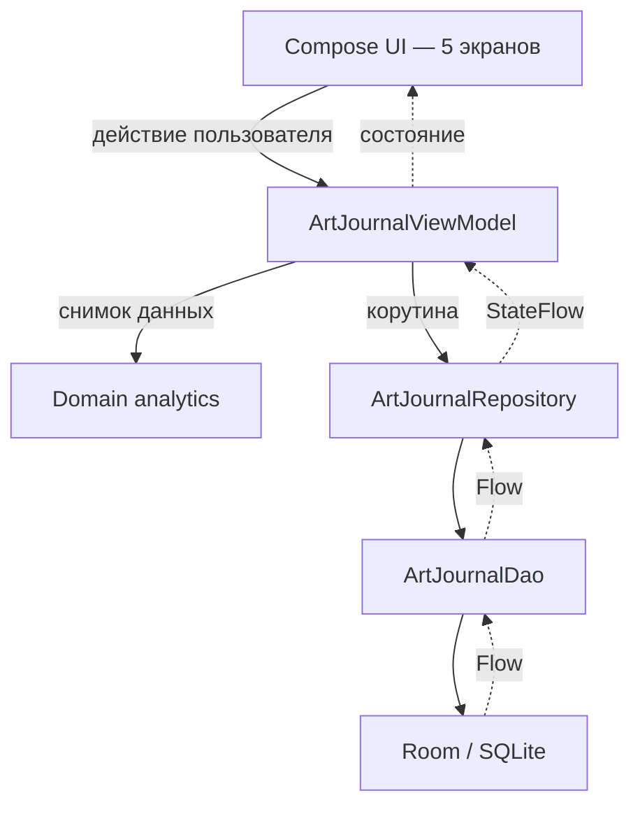

<div align="center">

# Художка Журнал

**Local-first Android-приложение для учета занятий в художественной школе**


</div>

## Что это

«Художка Журнал» — однопользовательское Android-приложение для преподавателя художественной школы. Оно хранит локальную базу учебных лет, групп, учеников, занятий, посещаемости, оценок, зачетных тем и платежей.

Мобильный клиент пока работает без регистрации и сетевых запросов: текущее
состояние сохраняется в Room/SQLite на устройстве и передаётся в
Compose-интерфейс через `Flow` и `StateFlow`.

В репозитории также развивается [изолированный backend](backend/README.md) на
Django/DRF и PostgreSQL. Он содержит нормализованную серверную модель и
транзакционный импорт резервной копии JSON v1, JWT-аутентификацию, школы,
членства, серверную матрицу ролей и защищённый API занятий, посещаемости и
оценок. Android-приложение к нему пока не подключено: Room остаётся источником
данных мобильного прототипа.

## Что реализовано

| Экран | Компонент | Назначение |
| --- | --- | --- |
| **Журнал** | `JournalScreen` | Таблица учеников и занятий, оценки `0–5`, посещаемость, домашние баллы, заметки, PDF-экспорт |
| **Темы** | `ThemesScreen` | Зачетные темы, критерии и максимальные баллы, индивидуальный прогресс `0–100%` |
| **Календарь** | `ScheduleScreen` | Учебные годы, четверти, праздники, дисциплины и недельные шаблоны групп |
| **Аналитика** | `TrackerScreen` | Сравнение учеников по дисциплинам, домашней работе и посещаемости |
| **Настройки** | `SettingsScreen` | Архив, демонстрационные данные, журнал действий и CSV-обмен через буфер |

Нижняя панель не использует Navigation Compose. `MainActivity` хранит выбранный раздел в общем `ArtJournalViewModel` и переключает пять Compose-экранов через `Crossfade`.

## Как работает приложение



1. `MainActivity` создает один экземпляр `ArtJournalViewModel`.
2. Экраны подписываются на `StateFlow` со списками сущностей и UI-фильтрами.
3. Пользовательское действие вызывает метод ViewModel.
4. ViewModel запускает корутину и обращается к репозиторию.
5. Репозиторий делегирует операцию Room DAO.
6. Room обновляет соответствующий `Flow`, после чего Compose перерисовывает затронутый интерфейс.

Расчёты посещаемости, успеваемости и предупреждающих сигналов находятся в
чистом Kotlin-модуле `domain/analytics`. ViewModel преобразует Room-сущности в
неизменяемый снимок и передаёт ему явные `groupId`, период и дату среза
`asOfDate`, поэтому правила можно тестировать без Android и базы данных.

DI-фреймворк не используется: база и репозиторий создаются непосредственно внутри ViewModel.

## Архитектурные слои

| Слой | Файлы | Ответственность |
| --- | --- | --- |
| UI | `ui/*.kt`, `MainActivity.kt` | Compose-разметка, диалоги, фильтры и ввод пользователя |
| State / application logic | `ArtJournalViewModel.kt` | UI-состояние, оркестрация операций, экспорт и журналирование действий |
| Domain analytics | `domain/analytics/*.kt` | Детерминированные расчёты и правила предупреждающих сигналов |
| Repository | `ArtJournalRepository.kt` | Тонкая абстракция над DAO |
| Persistence | `ArtJournalDao.kt`, `ArtJournalDatabase.kt` | Room-запросы и локальная SQLite-база |
| Model | `Entities.kt` | 10 Room-сущностей и преобразование строковых полей |

## Модель данных

| Таблица | Kotlin-сущность | Содержимое |
| --- | --- | --- |
| `academic_years` | `AcademicYear` | Учебный год, активность, праздники |
| `groups` | `Group` | Группа, дисциплины, недельный шаблон |
| `students` | `Student` | Карточка ученика, статус, договор, дополнительные поля |
| `payments` | `Payment` | История платежей за обучение |
| `quarters` | `Quarter` | Учебные периоды и границы дат |
| `lessons` | `Lesson` | Дата, группа, дисциплина и тема занятия |
| `student_lesson_states` | `StudentLessonState` | Оценка, присутствие, домашние баллы, комментарии |
| `topics` | `Topic` | Зачетная тема, критерии и привязки |
| `student_topic_progress` | `StudentTopicProgress` | Прогресс и баллы ученика по теме |
| `audit_logs` | `AuditLog` | Последние действия и данные для частичной отмены |

Связи между сущностями задаются числовыми идентификаторами, но Room foreign keys и каскадное удаление пока не настроены. Списки дисциплин, критериев и идентификаторов сериализуются вручную в строковые поля.

Подробная документация:

- [текущая модель данных Room v2](docs/data-model-current.md);
- [ADR-0001: переход к backend на Django/DRF и PostgreSQL](docs/adr/0001-server-backed-architecture.md);
- [целевая серверная модель и контракт импорта](docs/server-data-model.md);
- [JWT, роли и серверная матрица доступа](docs/access-control.md);
- [OpenAPI-контракт и правила документирования endpoints](docs/openapi.md);
- [формат резервной копии JSON v1](docs/backup-format-v1.md).

## Стек

| Технология | Версия в проекте | Использование |
| --- | ---: | --- |
| Kotlin | `2.2.10` | Основной язык |
| Android Gradle Plugin | `9.1.1` | Сборка Android-модуля |
| Jetpack Compose BOM | `2024.09.00` | UI и Material 3 |
| Activity Compose | `1.10.1` | Compose-host в `MainActivity` |
| Lifecycle | `2.8.7` | ViewModel, runtime и Compose-интеграция |
| Room | `2.7.0` | Локальная база SQLite |
| Kotlin Coroutines | `1.10.2` | Асинхронные операции и потоки |
| KSP | `2.3.5` | Генерация Room-кода |
| JUnit | `4.13.2` | JVM-тесты |
| Robolectric | `4.16.1` | Android-тесты на JVM |
| Roborazzi | `1.59.0` | Screenshot-тест |

Retrofit, Moshi и OkHttp подключены как основа будущей интеграции Android-клиента с Django API, но текущая реализация ещё не создаёт сетевой клиент и не обращается к серверу. Неиспользуемая шаблонная конфигурация генеративного API удалена.

## Параметры Android

| Параметр | Значение |
| --- | --- |
| Application ID | `com.ajuia.artjournal` |
| Namespace | `com.ajuia.artjournal` |
| Minimum SDK | API 24 / Android 7.0 |
| Target SDK | API 36 |
| Compile SDK | Android 36.1 |
| Version | `1.0` (`versionCode = 1`) |
| Java compatibility | Java 11 |
| UI theme | Material 3, фиксированная черно-желтая палитра |

## Структура репозитория

```text
artjournal/
├── app/
│   ├── build.gradle.kts
│   └── src/
│       ├── main/
│       │   ├── AndroidManifest.xml
│       │   ├── java/com/ajuia/artjournal/
│       │   │   ├── MainActivity.kt
│       │   │   ├── data/
│       │   │   ├── domain/analytics/
│       │   │   ├── ui/
│       │   │   └── viewmodel/
│       │   └── res/
│       ├── test/
│       └── androidTest/
├── gradle/libs.versions.toml
├── build.gradle.kts
└── settings.gradle.kts
```

## Как запустить

### Требования

- Android Studio с поддержкой Android Gradle Plugin `9.1.1`;
- JDK 17 для запуска Gradle;
- Android SDK 36.1;
- эмулятор или физическое устройство с Android 7.0+;
- `keytool` из установленного JDK.

### 1. Клонировать проект

```bash
git clone https://github.com/ajuia-m/artjournal.git
cd artjournal
```

### 2. Открыть в Android Studio

Откройте корневую папку `artjournal`, выберите JDK 17 как Gradle JDK и установите Android SDK 36.1, если IDE предложит это сделать.

> [!IMPORTANT]
> Используйте Gradle Wrapper из репозитория. Он фиксирует Gradle `9.3.1`, а
> `distributionSha256Sum` проверяет целостность загруженного дистрибутива.

### 3. Создать debug-keystore

Debug-сборка явно ожидает файл `debug.keystore` в корне проекта. Создайте его командой:

```bash
keytool -genkeypair -v -keystore debug.keystore -storepass android -alias androiddebugkey -keypass android -dname "CN=Android Debug,O=Android,C=US" -keyalg RSA -keysize 2048 -validity 10000
```

Файл уже исключен из Git через `.gitignore`.

### 4. Синхронизировать и запустить

1. Выполните **Sync Project with Gradle Files**.
2. Выберите конфигурацию `app`.
3. Запустите эмулятор или подключите устройство.
4. Нажмите **Run**.

API-ключ и файл `.env` для текущих функций приложения не требуются.

## Сборка release

Release-конфигурация использует keystore alias `upload`. Перед сборкой задайте:

```bash
export KEYSTORE_PATH=/absolute/path/to/my-upload-key.jks
export STORE_PASSWORD=your_store_password
export KEY_PASSWORD=your_key_password
```

Затем запустите release-сборку из Android Studio или командой:

```bash
./gradlew assembleRelease
```

## Тестирование

В репозитории находятся:

- `AnalyticsCalculatorTest` — посещаемость, домашняя работа и баллы по дисциплинам;
- `StudentRiskEvaluatorTest` — серии пропусков и платёжная эвристика;
- `AnalyticsSnapshotMapperTest` — преобразование Room-сущностей в domain-снимок;
- `ArtJournalBackupCodecTest` и `ArtJournalBackupExporterTest` — формат и полнота JSON-экспорта;
- `ExampleUnitTest` — базовая проверка JUnit;
- `ExampleRobolectricTest` — ресурс приложения и запуск `MainActivity`;
- `GreetingScreenshotTest` — пример Roborazzi screenshot-теста;
- `ExampleInstrumentedTest` — Android instrumented test.

Через Android Studio тесты можно запускать из контекстного меню класса или каталога. Из терминала:

```bash
./gradlew testDebugUnitTest
./gradlew connectedDebugAndroidTest
```

Ключевые правила аналитики и резервного копирования покрыты unit-тестами.
Остальная бизнес-логика экранов и операций с журналом пока покрыта частично.

## Экспорт данных

- `ArtJournalBackupExporter` сохраняет все десять таблиц в
  [версионированный JSON v1](docs/backup-format-v1.md) через системный выбор
  файла;
- `exportGroupJournalToPDF()` создает одностраничный PDF до 12 занятий и сохраняет его в `Downloads`.
- `exportToCSVString()` сериализует данные в текст и помещает их в буфер обмена через экран настроек.
- `importFromCSVString()` сейчас импортирует только `YEAR`, `GROUP` и `STUDENT`.
- `AuditLog` хранит не более 100 записей; записи старше 30 дней удаляются при запуске ViewModel.

## Технический статус

Проект является прототипом. Для работы с реальными данными еще необходимы безопасные Room-миграции, foreign keys, полный backup/restore, динамические даты вместо значений 2026 года, современная запись PDF через MediaStore и тесты бизнес-логики.
[README.md](https://github.com/user-attachments/files/30489626/README.md)

# Основные возможности приложения:
## Журнал и Учет занятий:
Отметка посещаемости учеников (присутствует, отсутствует, болеет, уважительная причина).
Выставление оценок, добавление комментариев к уроку, фиксация замечаний и учет оплаты обучения.
Быстрое редактирование расписания и предметов прямо из карточки группы.
## Календарь и Учебные года:
Создание и переключение между несколькими учебными годами с возможностью переноса структуры групп прошлых лет (без переноса личных оценок и заметок).
Интерактивный календарь нерабочих праздничных дней с возможностью как текстового ввода, так и выбора дат на сетке месяца.
Настройка рамок учебных четвертей и шаблонов расписания по дням недели.
## Зачетные темы и Критерии:
Создание тем зачетов с гибкой настройкой индивидуальных критериев оценивания и максимальных баллов (композиция, цвет, светотень и др.).
Удобный подсчет суммарного балла и фиксация процента выполнения работы учениками при помощи слайдеров.
## Карточки Учеников:
Полный профиль учащегося с общей статистикой посещаемости, оценками, замечаниями и историей платежей.
Поддержка архивирования и восстановления учеников.
## Настройки и Архив:
Переключатель отображения архивированных учеников в журналах.
Ведение логов действий и инструмент резервного копирования базы данных.
