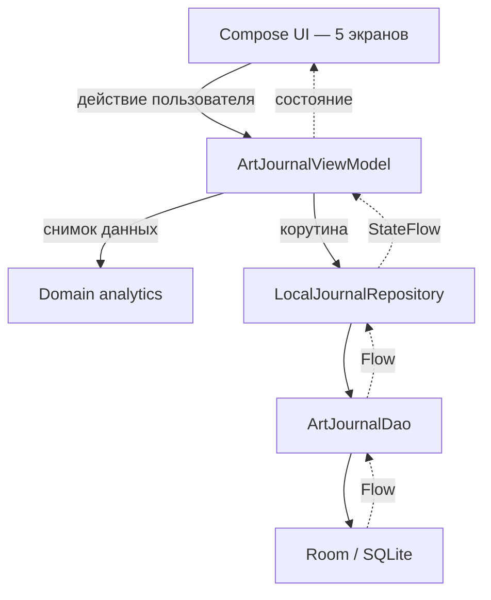

<div align="center">


# Художка Журнал

**Android-приложение и Django/DRF backend для управления учебным процессом художественной школы**


[](https://github.com/ajuia-m/artjournal/actions/workflows/android-ci.yml)
[](https://github.com/ajuia-m/artjournal/actions/workflows/backend-ci.yml)

**[English](README.md) · Русский**

</div>

## Что это

«Художка Журнал» — однопользовательское Android-приложение для преподавателя художественной школы. Оно хранит локальную базу учебных лет, групп, учеников, занятий, посещаемости, оценок, зачетных тем и платежей.

Мобильный клиент пока работает без регистрации и сетевых запросов: текущее
состояние сохраняется в Room/SQLite на устройстве и передаётся в
Compose-интерфейс через `Flow` и `StateFlow`.

В репозитории также развивается [изолированный backend](backend/README.md) на
Django/DRF и PostgreSQL. Он содержит нормализованную серверную модель и
транзакционный импорт резервной копии JSON v1, JWT-аутентификацию, школы,
членства, серверную матрицу ролей и защищённый API занятий, посещаемости и
оценок. Android-приложение к нему пока не подключено: Room остаётся источником
данных мобильного прототипа.

Первое подключение Android будет server-authoritative, но позволит изменять
поддерживаемые данные без сети. Room хранит рабочую копию и транзакционный
outbox, а WorkManager отправляет операции после восстановления соединения.
Сервер дедуплицирует команды, проверяет версию записи и возвращает явный
конфликт вместо скрытого last-write-wins. Стратегия подключения и sync-протокол
зафиксированы в [ADR-0002](docs/adr/0002-android-server-integration.md) и
[ADR-0003](docs/adr/0003-offline-write-synchronization.md).

## Что реализовано

| Экран | Компонент | Назначение |
| --- | --- | --- |
| **Журнал** | `JournalScreen` | Таблица учеников и занятий, оценки `0–5`, посещаемость, домашние баллы, заметки, PDF-экспорт |
| **Темы** | `ThemesScreen` | Зачетные темы, критерии и максимальные баллы, индивидуальный прогресс `0–100%` |
| **Календарь** | `ScheduleScreen` | Учебные годы, четверти, праздники, дисциплины и недельные шаблоны групп |
| **Аналитика** | `TrackerScreen` | Сравнение учеников по дисциплинам, домашней работе и посещаемости |
| **Настройки** | `SettingsScreen` | Архив, демонстрационные данные, журнал действий и CSV-обмен через буфер |

Нижняя панель не использует Navigation Compose. `MainActivity` хранит выбранный раздел в общем `ArtJournalViewModel` и переключает пять Compose-экранов через `Crossfade`.

## Roadmap

Статусы относятся только к изменениям, уже находящимся в `main`:
**✅ выполнено**, **○ предстоит выполнить**.

### 1. Надёжный локальный Android-прототип

- ✅ Gradle Wrapper, проверка checksum и воспроизводимая CI-сборка.
- ✅ Экспорт Room schema v2 и проверка схемы в GitHub Actions.
- ✅ Полный версионированный экспорт всех десяти Room-таблиц в JSON v1.
- ✅ Документация текущей модели и ADR перехода к server-backed архитектуре.
- ✅ Расчёты аналитики вынесены из ViewModel и покрыты unit-тестами.
- ✅ Период «Весь учебный год» вычисляется из четвертей/занятий, а аналитика
  обновляется после изменения оценок, тем и прогресса.
- ✅ Пакет приложения приведён к `com.ajuia.artjournal`.
- ✅ Ручной `AppContainer`, repository boundary и внедрение зависимостей во
  ViewModel без прямого доступа Compose UI к Room.
- ✅ Compose smoke-тест запускается на управляемом эмуляторе в GitHub Actions.
- ○ Добавить явные Room migrations и тесты перехода между версиями.
- ○ Добавить foreign keys, индексы и ограничения локальной legacy-модели либо
  окончательно перевести эти сценарии на сервер.
- ○ Реализовать полное восстановление из JSON и решить шифрование backup-файла.
- ○ Убрать оставшиеся production-значения дат 2026 года и перейти на MediaStore
  для PDF-экспорта.

### 2. Backend, данные и безопасность

- ✅ Django 5.2, DRF, PostgreSQL 17, Docker Compose и health check.
- ✅ Нормализованная серверная модель, UUID, миграции, FK, индексы и constraints.
- ✅ JSON Schema v1 и транзакционный импорт с `--dry-run`, SHA-256,
  идемпотентностью, `ImportBatch` и отчётом ошибок.
- ✅ Пользователи, школы, членства, роли `admin`/`teacher` и назначения групп.
- ✅ JWT access/refresh, ротация, blacklist и серверная матрица доступа.
- ✅ OpenAPI 3.0.3, Swagger UI и CI-валидация схемы.
- ✅ Защищённый journal API для занятий, нескольких тем занятия, посещаемости,
  оценок и домашней работы с тестами прав доступа.
- ✅ Первый sync vertical slice для `StudentLessonState`: версии, идемпотентный
  command log, tombstone, cursor change feed и фильтрация по назначениям.
- ○ Реализовать API прогресса по зачётным темам и оценок по критериям.
- ○ Открыть существующий import service через защищённый school-scoped endpoint
  с лимитом файла и режимом dry run.
- ○ Добавить чёрные ящики API-тестов против реально запущенного Docker Compose:
  JWT, создание занятия, изменение состояния и отказ для чужой школы.

### 3. Подключение Android к backend

- ✅ ADR-0002: PostgreSQL остаётся серверным источником истины, а локальный и
  серверный режимы не смешиваются.
- ✅ ADR-0003: зафиксирован протокол offline-записей через Room outbox,
  идемпотентные команды, версии, tombstone и change feed.
- ✅ Локальные зависимости вынесены в composition root; Room явно ограничен
  режимом `Local legacy`.
- ○ Создать Retrofit/Moshi API client, sync DTO, mapper и единый тип сетевых ошибок.
- ○ Реализовать вход, безопасное хранение refresh token, обновление access token
  и logout.
- ○ Загружать доступные школы и явно выбирать рабочую школу.
- ○ Добавить стабильные UUID, Room-таблицы outbox/sync metadata/conflicts и
  миграционные тесты.
- ○ Расширить backend sync на занятия, зависимости команд, прогресс и критерии;
  добавить snapshot recovery и retention policy.
- ○ Подключить server-backed чтение групп, учеников, занятий и состояний.
- ○ Подключить локальное создание и изменение занятия, посещаемости, оценки,
  домашней работы и прогресса с атомарной записью операции в outbox.
- ○ Запускать отправку outbox через WorkManager и показывать статусы
  `pending`/`syncing`/`conflict`/`rejected` в интерфейсе.
- ○ Реализовать контролируемый перенос JSON v1 из `Local legacy` в
  `Server workspace` без повторного смешивания данных.
- ○ Добавить сквозной тест Android → JWT → Django API → PostgreSQL → повторное
  чтение после перезапуска клиента.

### 4. Тестирование и наблюдаемость

- ✅ Pytest покрывает импорт, ограничения модели, JWT, роли и права journal API.
- ✅ Android CI запускает unit-, Robolectric-, lint-, build- и Compose UI-проверки.
- ✅ Известные ограничения модели, импорта и доступа зафиксированы в документации.
- ○ Добавить Compose-сценарии создания ученика, занятия, посещаемости и оценки,
  а также проверку сохранения после перезапуска.
- ○ Сохранять скриншоты и расширенную диагностику при падении emulator-тестов.
- ○ Добавить структурированные server logs, журнал ошибок и error monitoring.
- ○ Подключить Allure к расширенному API/UI-набору; Playwright имеет смысл только
  после появления web-интерфейса и не входит в критический путь Android MVP.

### 5. Демоверсия и проверка продукта

- ○ Развернуть публичный backend и подготовить устанавливаемую тестовую Android-сборку.
- ○ Создать полностью обезличенную демонстрационную школу и тестовые аккаунты
  преподавателя/администратора.
- ○ Реализовать импорт расписания и серверный экспорт отчётов.
- ○ Провести тестирование с 5–10 пользователями и собрать несколько реальных
  отзывов преподавателей.
- ○ Описать результаты пилота, найденные дефекты, архитектурные компромиссы и
  известные ограничения как полноценный коммерчески убедительный case study.
- ○ Перенести пункты roadmap в GitHub Issues и milestone после стабилизации
  состава ближайшего релиза.

Ближайший критический путь: **Android API client, JWT и выбор школы → отдельная
Room-реплика, outbox и WorkManager → offline-синхронизация посещаемости и оценок
→ API прогресса и критериев → защищённый импорт → offline/online сквозной тест
→ публичная демоверсия**.

## Как работает приложение



1. `MainActivity` создает один экземпляр `ArtJournalViewModel`.
2. Экраны подписываются на `StateFlow` со списками сущностей и UI-фильтрами.
3. Пользовательское действие вызывает метод ViewModel.
4. ViewModel запускает корутину и обращается к репозиторию.
5. Репозиторий делегирует операцию Room DAO.
6. Room обновляет соответствующий `Flow`, после чего Compose перерисовывает затронутый интерфейс.

Расчёты посещаемости, успеваемости и предупреждающих сигналов находятся в
чистом Kotlin-модуле `domain/analytics`. ViewModel преобразует Room-сущности в
неизменяемый снимок и передаёт ему явные `groupId`, период и дату среза
`asOfDate`, поэтому правила можно тестировать без Android и базы данных.

DI-фреймворк не используется. `ArtJournalApplication` создаёт ручной
`AppContainer`, а `ArtJournalViewModelFactory` передаёт ViewModel интерфейс
локального репозитория и экспортёр резервной копии. UI больше не обращается к
репозиторию напрямую.

## Архитектурные слои

| Слой | Файлы | Ответственность |
| --- | --- | --- |
| UI | `ui/*.kt`, `MainActivity.kt` | Compose-разметка, диалоги, фильтры и ввод пользователя |
| State / application logic | `ArtJournalViewModel.kt` | UI-состояние, оркестрация операций, экспорт и журналирование действий |
| Domain analytics | `domain/analytics/*.kt` | Детерминированные расчёты и правила предупреждающих сигналов |
| Composition root | `ArtJournalApplication.kt`, `AppContainer.kt` | Создание локальных зависимостей вне UI и ViewModel |
| Repository | `LocalJournalRepository.kt` | Интерфейс legacy-хранилища и Room-реализация над DAO |
| Persistence | `ArtJournalDao.kt`, `ArtJournalDatabase.kt` | Room-запросы и локальная SQLite-база |
| Model | `Entities.kt` | 10 Room-сущностей и преобразование строковых полей |

## Модель данных

| Таблица | Kotlin-сущность | Содержимое |
| --- | --- | --- |
| `academic_years` | `AcademicYear` | Учебный год, активность, праздники |
| `groups` | `Group` | Группа, дисциплины, недельный шаблон |
| `students` | `Student` | Карточка ученика, статус, договор, дополнительные поля |
| `payments` | `Payment` | История платежей за обучение |
| `quarters` | `Quarter` | Учебные периоды и границы дат |
| `lessons` | `Lesson` | Дата, группа, дисциплина и тема занятия |
| `student_lesson_states` | `StudentLessonState` | Оценка, присутствие, домашние баллы, комментарии |
| `topics` | `Topic` | Зачетная тема, критерии и привязки |
| `student_topic_progress` | `StudentTopicProgress` | Прогресс и баллы ученика по теме |
| `audit_logs` | `AuditLog` | Последние действия и данные для частичной отмены |

Связи между сущностями задаются числовыми идентификаторами, но Room foreign keys и каскадное удаление пока не настроены. Списки дисциплин, критериев и идентификаторов сериализуются вручную в строковые поля.

Подробная документация:

- [текущая модель данных Room v2](docs/data-model-current.md);
- [ADR-0001: переход к backend на Django/DRF и PostgreSQL](docs/adr/0001-server-backed-architecture.md);
- [ADR-0002: подключение Android к server-backed режиму](docs/adr/0002-android-server-integration.md);
- [ADR-0003: offline-записи и протокол синхронизации](docs/adr/0003-offline-write-synchronization.md);
- [целевая серверная модель и контракт импорта](docs/server-data-model.md);
- [JWT, роли и серверная матрица доступа](docs/access-control.md);
- [OpenAPI-контракт и правила документирования endpoints](docs/openapi.md);
- [формат резервной копии JSON v1](docs/backup-format-v1.md).

## Стек

| Технология | Версия в проекте | Использование |
| --- | ---: | --- |
| Kotlin | `2.2.10` | Основной язык |
| Android Gradle Plugin | `9.1.1` | Сборка Android-модуля |
| Jetpack Compose BOM | `2024.09.00` | UI и Material 3 |
| Activity Compose | `1.10.1` | Compose-host в `MainActivity` |
| Lifecycle | `2.8.7` | ViewModel, runtime и Compose-интеграция |
| Room | `2.7.0` | Локальная база SQLite |
| Kotlin Coroutines | `1.10.2` | Асинхронные операции и потоки |
| KSP | `2.3.5` | Генерация Room-кода |
| JUnit | `4.13.2` | JVM-тесты |
| Robolectric | `4.16.1` | Android-тесты на JVM |
| Roborazzi | `1.59.0` | Screenshot-тест |

Retrofit, Moshi и OkHttp подключены как основа будущей интеграции Android-клиента с Django API, но текущая реализация ещё не создаёт сетевой клиент и не обращается к серверу. Неиспользуемая шаблонная конфигурация генеративного API удалена.

### Backend

| Технология | Версия в проекте | Использование |
| --- | ---: | --- |
| Python | `3.13` в CI и контейнере | Runtime |
| Django | `5.2.16` | Web-приложение и ORM |
| Django REST Framework | `3.17.1` | HTTP API |
| Simple JWT | `5.5.1` | JWT lifecycle и blacklist |
| drf-spectacular | `0.30.0` | OpenAPI 3.0.3 и Swagger UI |
| PostgreSQL | `17-alpine` | База Compose и CI |
| Psycopg | `3.3.4` | PostgreSQL driver |
| Gunicorn | `26.0.0` | Сервер приложения в контейнере |
| JSON Schema | `4.25.1` | Проверка backup и sync-контрактов |
| Pytest | `9.1.1` | Backend-тесты |
| pytest-django | `4.12.0` | Интеграция Django с Pytest |
| Ruff | `0.16.0` | Линтинг и форматирование |

## Параметры Android

| Параметр | Значение |
| --- | --- |
| Application ID | `com.ajuia.artjournal` |
| Namespace | `com.ajuia.artjournal` |
| Minimum SDK | API 24 / Android 7.0 |
| Target SDK | API 36 |
| Compile SDK | Android 36.1 |
| Version | `1.0` (`versionCode = 1`) |
| Java compatibility | Java 11 |
| UI theme | Material 3, фиксированная черно-желтая палитра |

## Структура репозитория

```text
artjournal/
├── .github/workflows/          # Android and backend CI
├── app/
│   ├── build.gradle.kts
│   └── src/
│       ├── main/
│       │   ├── AndroidManifest.xml
│       │   ├── java/com/ajuia/artjournal/
│       │   │   ├── ArtJournalApplication.kt
│       │   │   ├── AppContainer.kt
│       │   │   ├── MainActivity.kt
│       │   │   ├── data/
│       │   │   ├── domain/analytics/
│       │   │   ├── ui/
│       │   │   └── viewmodel/
│       │   └── res/
│       ├── test/
│       └── androidTest/
├── backend/                    # Django/DRF service and tests
│   ├── apps/
│   ├── config/
│   ├── requirements/
│   ├── Dockerfile
│   └── README.md
├── docs/                       # Data contracts and ADRs
│   ├── adr/
│   ├── examples/
│   └── schemas/
├── gradle/libs.versions.toml
├── compose.yaml                # Django + PostgreSQL development stack
├── README.md                   # Main English overview
├── README.ru.md                # Russian overview
├── build.gradle.kts
└── settings.gradle.kts
```

## Как запустить

### Требования

- Android Studio с поддержкой Android Gradle Plugin `9.1.1`;
- JDK 17 для запуска Gradle;
- Android SDK 36.1;
- эмулятор или физическое устройство с Android 7.0+.

### 1. Клонировать проект

```bash
git clone https://github.com/ajuia-m/artjournal.git
cd artjournal
```

### 2. Открыть в Android Studio

Откройте корневую папку `artjournal`, выберите JDK 17 как Gradle JDK и установите Android SDK 36.1, если IDE предложит это сделать.

> [!IMPORTANT]
> Используйте Gradle Wrapper из репозитория. Он фиксирует Gradle `9.3.1`, а
> `distributionSha256Sum` проверяет целостность загруженного дистрибутива.

### 3. Синхронизировать и запустить

1. Выполните **Sync Project with Gradle Files**.
2. Выберите конфигурацию `app`.
3. Запустите эмулятор или подключите устройство.
4. Нажмите **Run**.

API-ключ и файл `.env` для текущих функций приложения не требуются.

Debug-сборка использует стандартную debug-подпись Android. Отдельный keystore в
корне репозитория создавать не нужно. Проверить сборку из терминала можно так:

```bash
./gradlew assembleDebug
```

## Быстрый запуск backend

Из корня репозитория:

```bash
cp .env.example .env
docker compose up --build
```

После применения миграций backend доступен на `http://localhost:8000`:

- health check — `http://localhost:8000/api/v1/health/`;
- Swagger UI — `http://localhost:8000/api/v1/docs/`;
- OpenAPI schema — `http://localhost:8000/api/v1/schema/`.

Подробная настройка пользователей, JWT, импорт и API описаны в
[backend README](backend/README.md).

## Краткий обзор API

Все защищённые endpoints используют Bearer JWT. Роли не считаются доверенными
claims токена: backend повторно проверяет активное членство и назначения.

| Область | Endpoint |
| --- | --- |
| JWT | `POST /api/v1/auth/token/`, `token/refresh/`, `token/logout/` |
| Текущий пользователь | `GET /api/v1/auth/me/` |
| Доступные школы | `GET /api/v1/schools/` |
| Членства | `/api/v1/schools/{schoolId}/memberships/` |
| Назначения | `/api/v1/schools/{schoolId}/teaching-assignments/` |
| Занятия | `/api/v1/schools/{schoolId}/groups/{groupId}/lessons/` |
| Состояния учеников | `.../lessons/{lessonId}/states/` |
| Offline-команды | `POST /api/v1/schools/{schoolId}/sync/commands/` |
| Change feed | `GET /api/v1/schools/{schoolId}/sync/changes/?cursor=...` |

Sync API пока поддерживает только `student_lesson_state`. Snapshot, sync
занятий, прогресса и критериев, а также retention ещё не реализованы.

## Сборка release

Release-конфигурация использует keystore alias `upload`. Перед сборкой задайте:

```bash
export KEYSTORE_PATH=/absolute/path/to/my-upload-key.jks
export STORE_PASSWORD=your_store_password
export KEY_PASSWORD=your_key_password
```

Затем запустите release-сборку из Android Studio или командой:

```bash
./gradlew assembleRelease
```

## Тестирование

В репозитории находятся:

- `AnalyticsCalculatorTest` — посещаемость, домашняя работа и баллы по дисциплинам;
- `StudentRiskEvaluatorTest` — серии пропусков и платёжная эвристика;
- `AnalyticsSnapshotMapperTest` — преобразование Room-сущностей в domain-снимок;
- `ArtJournalBackupCodecTest` и `ArtJournalBackupExporterTest` — формат и полнота JSON-экспорта;
- `ExampleUnitTest` — базовая проверка JUnit;
- `ExampleRobolectricTest` — ресурс приложения и запуск `MainActivity`;
- `GreetingScreenshotTest` — пример Roborazzi screenshot-теста;
- `JournalComposeUiTest` — запуск `MainActivity` на эмуляторе, переходы между
  основными разделами, загрузка демо-данных и проверка журнала.

Через Android Studio тесты можно запускать из контекстного меню класса или каталога. Из терминала:

```bash
./gradlew testDebugUnitTest
./gradlew connectedDebugAndroidTest
./gradlew pixel2api30DebugAndroidTest \
  -Pandroid.testoptions.manageddevices.emulator.gpu=swiftshader_indirect
```

Последняя команда создаёт чистый Gradle Managed Device `Pixel 2` с API 30,
запускает Compose UI-тест и затем удаляет эмулятор. Тот же сценарий выполняется
в отдельной задаче Android CI; HTML-отчёт сохраняется в GitHub Actions на 14
дней.

Ключевые правила аналитики и резервного копирования покрыты unit-тестами.
Compose UI пока покрывает один критический сквозной сценарий; операции создания
ученика, занятия и оценки остаются следующими кандидатами.

## Экспорт данных

- `ArtJournalBackupExporter` сохраняет все десять таблиц в
  [версионированный JSON v1](docs/backup-format-v1.md) через системный выбор
  файла;
- `exportGroupJournalToPDF()` создает одностраничный PDF до 12 занятий и сохраняет его в `Downloads`.
- `exportToCSVString()` сериализует данные в текст и помещает их в буфер обмена через экран настроек.
- `importFromCSVString()` сейчас импортирует только `YEAR`, `GROUP` и `STUDENT`.
- `AuditLog` хранит не более 100 записей; записи старше 30 дней удаляются при запуске ViewModel.

## Технический статус

Проект остаётся прототипом: локальный Android-клиент и защищённый backend уже
работают и тестируются независимо, но ещё не соединены в один пользовательский
сценарий. До использования с реальными персональными данными необходимо закрыть
пункты безопасности данных, Android-аутентификации, миграции и deployment из
[roadmap](#roadmap).

Основные ограничения текущего `main`:

- Android использует локальные `Int` ID без Room foreign keys и явных upgrade
  migrations;
- в Android нет login, выбора школы, Room outbox, WorkManager sync и UI
  конфликтов;
- backend sync охватывает только состояния учеников и не имеет snapshot
  endpoint;
- защищённый HTTP import endpoint, progress API и серверный экспорт отчётов
  отсутствуют;
- JSON v1 не шифруется и предназначен для контролируемой миграции, а не для
  регулярной синхронизации.
