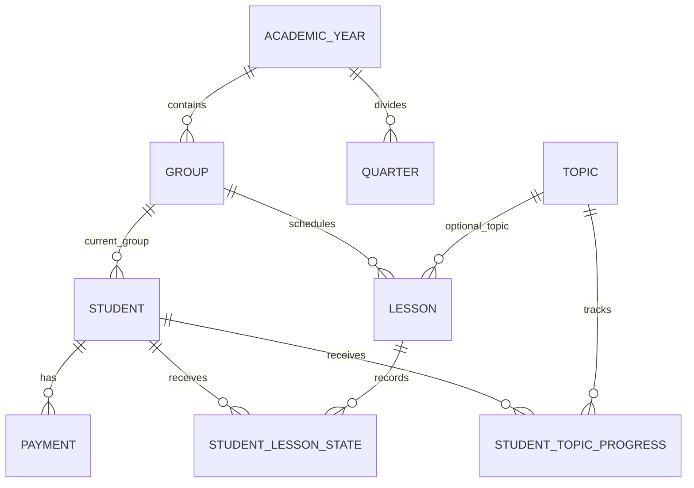

# Текущая модель данных Art Journal

> Исходный снимок модели зафиксирован 29 июля 2026 года. Ссылки и сведения о
> конфигурации Room актуализированы 1 августа 2026 года; сама legacy-модель
> сущностей не нормализовалась.

Этот документ описывает фактическую локальную модель приложения до появления backend. Он нужен как контрольная точка для проектирования API, нормализации схемы и переноса пользовательских данных. Это не целевая схема PostgreSQL.

Связанное архитектурное решение: [ADR-0001 — переход к server-backed архитектуре](adr/0001-server-backed-architecture.md).

## Где и как хранятся данные

- единственный источник истины — локальная база Room/SQLite на устройстве;
- имя базы — `art_journal_database`;
- версия схемы — `2`;
- схема Room v2 экспортируется в `app/schemas` и проверяется CI;
- явные переходы со старых версий пока не описаны; destructive fallback удалён,
  поэтому следующий bump версии обязан сначала добавить и протестировать migration;
- все идентификаторы — локальные автоинкрементные `Int`;
- пользователей, ролей, школы/организации и владельца данных в модели нет;
- Repository в основном передаёт операции в DAO, а правила предметной области сосредоточены в `ArtJournalViewModel`.

Основные источники:

- [Entities.kt](../app/src/main/java/com/ajuia/artjournal/data/Entities.kt);
- [ArtJournalDao.kt](../app/src/main/java/com/ajuia/artjournal/data/ArtJournalDao.kt);
- [ArtJournalDatabase.kt](../app/src/main/java/com/ajuia/artjournal/data/ArtJournalDatabase.kt);
- [LocalJournalRepository.kt](../app/src/main/java/com/ajuia/artjournal/data/LocalJournalRepository.kt);
- [ArtJournalViewModel.kt](../app/src/main/java/com/ajuia/artjournal/viewmodel/ArtJournalViewModel.kt).

## Логическая схема

Связи ниже выводятся из полей `...Id` и поведения приложения. Room их не контролирует: в сущностях нет `ForeignKey`, индексов и каскадных правил.

Привязки `Topic` к группам и четвертям не показаны как отношения: они сериализованы в строках `groupIds` и `quarterIds`.

## Справочник таблиц

### Учебная структура

| Таблица / сущность | Поля | Назначение и фактические ограничения |
|---|---|---|
| `academic_years` / `AcademicYear` | `id: Int` PK; `name: String`; `holidays: String = ""`; `isActive: Boolean = false`; `quarterMarkers: String = ""` | Учебный год. Канонического формата `name` нет. Выбор только одного активного года обеспечивается ViewModel, но не базой. Если активный год не найден, UI использует первую запись из выборки, отсортированной по `id DESC`. |
| `groups` / `Group` | `id: Int` PK; `name: String`; `academicYearId: Int`; `disciplines: String`; `schedule: String = ""` | Группа в учебном году. `academicYearId` — логическая ссылка без FK. Дисциплины и расписание хранятся в сериализованных строках. |
| `quarters` / `Quarter` | `id: Int` PK; `academicYearId: Int`; `name: String`; `startDate: String`; `endDate: String` | Четверть или произвольный учебный период. Пересечения периодов, порядок дат и принадлежность году базой не проверяются. |

### Ученики и оплаты

| Таблица / сущность | Поля | Назначение и фактические ограничения |
|---|---|---|
| `students` / `Student` | `id: Int` PK; `lastName: String`; `firstName: String`; `birthday: String = ""`; `enrollmentDate: String = ""`; `paperPaymentDate: String?`; `paperPaymentAmount: Double?`; `contractNumber: String = ""`; `groupId: Int`; `status: String = "active"`; `archiveDate: String?`; `archiveReason: String?`; `customFields: String = ""` | Карточка ученика и его текущая группа. `groupId` не защищён FK. Допустимые статусы подразумеваются как `active`, `archived`, `deleted`, но `CHECK`-ограничения нет. |
| `payments` / `Payment` | `id: Int` PK; `studentId: Int`; `date: String`; `amount: Double`; `comment: String = ""` | История внесённых оплат за обучение. Это учётная запись, а не платёжная транзакция провайдера. Сумма хранится в `Double`, валюта и статус отсутствуют. |

`paperPaymentDate` и `paperPaymentAmount` относятся к оплате материалов и существуют отдельно от таблицы `payments`.

### Журнал и оценивание

| Таблица / сущность | Поля | Назначение и фактические ограничения |
|---|---|---|
| `lessons` / `Lesson` | `id: Int` PK; `groupId: Int`; `date: String`; `discipline: String`; `topicId: Int?`; `customTopicName: String?`; `isNonSchoolDay: Boolean = false` | Занятие или неучебный день группы. Ссылки на группу и тему логические. Уникальности по группе, дате и дисциплине нет. |
| `student_lesson_states` / `StudentLessonState` | `id: Int` PK; `studentId: Int`; `lessonId: Int`; `grade: Int?`; `isPresent: Boolean = true`; `isExcusedAbsence: Boolean = false`; `homeworkPoints: Int?`; `comment: String?`; `note: String?` | Состояние ученика на занятии: посещение, оценка и заметки. ViewModel ищет одну запись по паре `(studentId, lessonId)`, но база не запрещает дубликаты. Диапазоны оценки `0..5` и домашней работы `0..101` существуют только как комментарии в коде. |
| `topics` / `Topic` | `id: Int` PK; `name: String`; `discipline: String`; `criteria: String = ""`; `groupIds: String = ""`; `quarterIds: String = ""` | Контрольная тема, её критерии и привязки. Критерии и обе связи «многие ко многим» сериализованы в строках. |
| `student_topic_progress` / `StudentTopicProgress` | `id: Int` PK; `studentId: Int`; `topicId: Int`; `stage: Int = 0`; `criteriaGrades: String = ""` | Прогресс ученика по теме. ViewModel ограничивает `stage` диапазоном `0..100`, однако база этого не делает. Уникальности `(studentId, topicId)` нет. |

### Аудит

| Таблица / сущность | Поля | Назначение и фактические ограничения |
|---|---|---|
| `audit_logs` / `AuditLog` | `id: Int` PK; `timestamp: Long`; `action: String`; `details: String`; `revertData: String?` | Локальная история действий и частичный механизм отмены. DAO выдаёт последние 100 записей. При создании ViewModel удаляются записи старше 30 дней. |

## Строковые форматы

| Значение | Текущий формат | Пример / замечание |
|---|---|---|
| Дата | строка `YYYY-MM-DD` | Сортировка и сравнение выполняются как для строк; формат базой не валидируется. |
| Праздники года | даты через `,` | `2026-01-01,2026-05-01` |
| Метки четвертей | даты начала через `,` | Поле есть в сущности, но отдельные `Quarter` также хранят периоды. |
| Дисциплины группы | названия через `,` | `Рисунок,Живопись,Композиция` |
| Расписание группы | `деньНедели:дисциплина` через `,` | `1:Рисунок,3:Живопись`, где день недели ожидается в диапазоне `1..7`. |
| Дополнительные поля ученика | `ключ::значение` через `\|\|` | Реальный parser использует `::`, хотя комментарий сущности показывает одинарный `:`. Экранирования разделителей нет. |
| Критерии темы | `название:максимум` через `,` | `Композиция:10,Цвет:10`; ошибочное число при чтении заменяется на `5`. |
| Группы/четверти темы | числовые ID через `,` | `1,2,5`; существование записей не проверяется. |
| Баллы по критериям | `название:балл` через `,` | `Композиция:8,Цвет:7`; ошибочное число при чтении заменяется на `0`. |
| Команда отмены | `REV:<команда>\|\|<аргументы>` | Поддерживаются `STUDENT_RESTORE`, `STUDENT_STATE_CHANGE` и `LESSON_DELETE`. Формат не экранируется и не версионируется. |

Имена, комментарии и пользовательские поля, содержащие `,`, `:`, `::` или `||`, могут нарушить соответствующий формат.

## Фактические правила жизненного цикла

### Ученик

- `active` — обычная активная запись;
- `archived` — запись остаётся доступной, к ней добавляются дата и причина архивации;
- `deleted` — мягкое удаление: DAO исключает запись из общего списка, но физически её не удаляет;
- удалить ученика разрешается только при отсутствии оценок, пропусков и баллов за домашнюю работу; иначе UI предлагает архив;
- восстановление меняет только статус и очищает архивные реквизиты;
- перевод в другую группу перезаписывает `groupId` и `enrollmentDate`; история зачислений и переводов не сохраняется;
- перенос учебного года создаёт копии выбранных учеников с новыми ID, а не переносит исходные записи.

### Урок и состояния учеников

- перед удалением урока Repository отдельной командой удаляет все связанные `StudentLessonState`, затем сам урок;
- эти две команды не объединены явной транзакцией;
- отмена удаления создаёт новый урок с новым ID, но удалённые состояния учеников не восстанавливает;
- сохранение состояния ученика полагается на поиск существующей пары `(studentId, lessonId)` в текущем `StateFlow`, а не на ограничение базы.

### Удаление родительских записей

Удаление учебного года, группы, четверти или темы выполняется напрямую. Без FK и каскадов оно может оставить группы, учеников, уроки, прогресс или другие записи с несуществующими ссылками.

### Очистка

`clearAllData()` очищает таблицы, после чего добавляет новую запись аудита «Сброс базы». Поэтому после операции база уже содержит как минимум одну запись.

## Импорт и экспорт CSV

Текущий экспорт включает годы, группы, учеников, оплаты, уроки и состояния на уроках. Он не включает четверти, темы, прогресс по темам и аудит. Часть полей экспортируемых сущностей также пропускается.

Импорт обрабатывает только строки `YEAR`, `GROUP` и `STUDENT`. Он:

- сохраняет исходные числовые ID;
- использует `OnConflictStrategy.REPLACE`, поэтому совпадение ID может заменить запись;
- не выполняет импорт в транзакции;
- не делает предварительную валидацию и итоговую сверку;
- разбивает строку простым `split(",")`, не поддерживая CSV-кавычки и запятые внутри значений;
- может оставить частично импортированный набор при ошибке в одной из следующих строк.

Этот формат нельзя считать полной резервной копией или безопасным транспортом миграции на сервер.

Для этой задачи введён отдельный
[формат полной резервной копии JSON v1](backup-format-v1.md). CSV сохранён только
для обратной совместимости.

## Что реально обеспечивает база

| Инвариант | Состояние |
|---|---|
| Уникальный первичный ключ каждой таблицы | Обеспечивается Room/SQLite. |
| Существование связанных года, группы, ученика, урока или темы | Не обеспечивается. |
| Один активный учебный год | Поддерживается операциями ViewModel, но не базой. |
| Одна запись журнала на ученика и урок | Предполагается кодом, но не обеспечивается. |
| Одна запись прогресса на ученика и тему | Предполагается кодом, но не обеспечивается. |
| Диапазоны оценок, баллов и прогресса | Частично ограничиваются UI/ViewModel, но не базой. |
| Валидные даты и `startDate <= endDate` | Не обеспечивается. |
| Неотрицательные денежные суммы | Не обеспечивается. |
| Атомарное удаление урока и зависимых состояний | Не обеспечивается. |
| Безопасная миграция схемы | Не обеспечивается; разрешена destructive migration. |

Все вставки используют `OnConflictStrategy.REPLACE`. Это удобно для текущего импорта, но маскирует конфликты идентификаторов и может заменять существующие строки вместо явного разрешения конфликта.

## Риски, которые должна закрыть серверная модель

1. Ввести владельца данных: школу и членство пользователя с ролью.
2. Заменить локальные ID на устойчивые серверные идентификаторы.
3. Нормализовать дисциплины, расписание, зачисления, критерии и их оценки.
4. Ввести FK, индексы, составные ограничения уникальности и проверки диапазонов.
5. Использовать типы `date`, `timestamp with time zone` и `decimal`, а не строки и `Double`.
6. Отделить аудит от механизма отмены действий.
7. Сделать версионированный, полный и идемпотентный импорт с проверкой результата.
8. До замены схемы добавить экспорт Room-схемы и явные миграции, чтобы обновление Android-приложения не уничтожало локальные данные.
