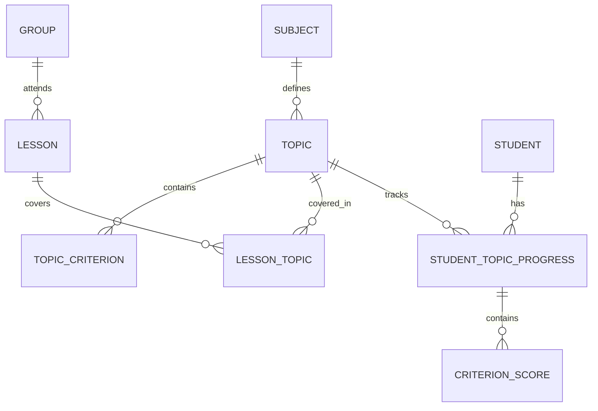

# Целевая серверная модель Art Journal

> Статус: реализованные серверная модель и импорт JSON v1.

Документ уточняет [ADR-0001](adr/0001-server-backed-architecture.md) и связывает
нормализованную PostgreSQL-модель с
[резервной копией Art Journal JSON v1](backup-format-v1.md). Текущая Room-модель
остаётся описанной отдельно и не копируется на сервер буквально.

## Границы предметной области

Сервер различает три вида данных:

1. **Учебный план** — что предполагается изучать: дисциплины, темы и критерии.
2. **Фактический журнал** — что произошло в конкретную дату: занятия,
   посещаемость и оценки.
3. **Результаты ученика** — прогресс по теме и баллы по её критериям.

Тема не принадлежит конкретной дате. Одна тема может занимать несколько
занятий, а одно занятие может включать несколько тем. Связь хранится в
`LessonTopic`.

Неучебный день также не является занятием. Значение Room
`Lesson.isNonSchoolDay = true` преобразуется в `CalendarException`, а не в
`Lesson`.



## Django-приложения

| Приложение | Сущности и ответственность |
|---|---|
| `accounts` | Минимальный кастомный `User`. JWT и пользовательские endpoints пока не входят в реализацию. |
| `schools` | `School` как обязательная граница владения данными. `Membership` и роли добавляются позднее. |
| `education` | `AcademicYear`, `AcademicPeriod`, `Group`, `Student`, `Enrollment`, `CalendarException`. |
| `curriculum` | `Subject`, `GroupSubject`, `ScheduleEntry`, `Topic`, `TopicCriterion`, `TopicGroupAssignment`, `TopicPeriodAssignment`. |
| `journal` | `Lesson`, `LessonTopic`, `StudentLessonState`, `StudentTopicProgress`, `CriterionScore`. |
| `tuition` | `Payment`; сумма хранится как decimal, валюта берётся из школы. |
| `imports` | `ImportBatch`, `LegacyObjectMap`, валидатор, импорт-сервис и management-команда. |
| `audit` | Доверенный append-only server audit и отдельная `LegacyAuditEntry`. |

Все сущности используют UUID как серверный первичный ключ. Внешние ключи,
ограничения и индексы создаются в начальных миграциях, а не откладываются до
появления API.

## Ключевые связи

### Школа и учебная структура

- `School` владеет учебными годами, группами, дисциплинами, учениками и
  импортами.
- `AcademicYear` содержит `AcademicPeriod`; в одной школе допускается не более
  одного активного учебного года.
- `Enrollment` хранит историю нахождения ученика в группе. У ученика может быть
  не более одного текущего зачисления.
- `ScheduleEntry` описывает недельный план, а `CalendarException` — отмену или
  изменение в конкретную дату.

### Темы и занятия

- `Topic` принадлежит дисциплине и содержит упорядоченные `TopicCriterion`.
- `TopicGroupAssignment` и `TopicPeriodAssignment` независимо назначают тему
  группам и учебным периодам. Тема может быть связана с несколькими группами и
  несколькими периодами без искусственной пары «группа — период».
- `Lesson` является фактом проведения занятия для группы и дисциплины в
  конкретную дату.
- `LessonTopic` связывает занятия и темы отношением many-to-many и хранит
  порядок тем внутри занятия.
- уникальна только пара `(lesson, topic)`. Уникальность занятия по
  `(group, date, subject)` не вводится: JSON v1 не содержит времени и не
  позволяет отличить повтор от второго занятия.

### Посещаемость и оценивание

- `StudentLessonState` уникален для пары `(student, lesson)` и хранит
  посещаемость, общую оценку занятия, домашние баллы и заметки.
- `StudentTopicProgress` уникален для пары `(student, topic)`.
- `CriterionScore` относится одновременно к прогрессу и критерию темы.
- импорт проверяет, что критерий действительно принадлежит теме прогресса и
  что балл не превышает максимум критерия.

### Оплаты и аудит

- `Payment.amount` — неотрицательный `DecimalField`.
- валюта обязательна и наследуется из `School.default_currency`, потому что
  JSON v1 её не содержит.
- импортированные `auditLogs` сохраняются как `LegacyAuditEntry` и никогда не
  считаются доверенными событиями сервера.
- `revertData` хранится как исходный текст, но не исполняется.

## Преобразование JSON v1

| JSON v1 | Серверная модель |
|---|---|
| `academicYears` | `AcademicYear`; holidays преобразуются в `CalendarException`. |
| `groups` | `Group`, `GroupSubject` и `ScheduleEntry`. |
| `students` | `Student` и текущее `Enrollment`. |
| `payments` | `Payment` с валютой школы. |
| `quarters` | `AcademicPeriod`. |
| `lessons` | `Lesson`; запись с `isNonSchoolDay=true` становится `CalendarException`. |
| `lessons[].topicId` | Одна исходная связь `LessonTopic`; после импорта сервер допускает несколько тем занятия. |
| `studentLessonStates` | `StudentLessonState`. |
| `topics` | `Topic`, `TopicCriterion`, `TopicGroupAssignment` и `TopicPeriodAssignment`. |
| `studentTopicProgress` | `StudentTopicProgress` и `CriterionScore`. |
| `auditLogs` | `LegacyAuditEntry`, изолированная от server audit. |

Исходный числовой ID не становится первичным ключом. Каждое сопоставление
сохраняется в `LegacyObjectMap(import_batch, entity_type, legacy_local_id,
server_object_id)`.

## Контракт импорта

Импорт состоит из двух фаз:

1. JSON Schema и предметная валидация без изменения базы.
2. Создание всех предметных записей внутри одной `transaction.atomic()`.

`ImportBatch` создаётся до предметной транзакции, чтобы отчёт об ошибке
сохранился даже после отката данных. Партия хранит:

- `export_id`;
- SHA-256 исходных байтов;
- целевую школу;
- метаданные `source`;
- статус `pending`, `running`, `succeeded` или `failed`;
- количество исходных и созданных объектов;
- структурированный список ошибок и предупреждений.

### Идемпотентность

- новый `exportId` запускает импорт;
- существующий `exportId` с тем же checksum возвращает прежний успешный
  результат без новых записей;
- существующий `exportId` с другим checksum отклоняется как конфликт;
- уникальное ограничение PostgreSQL на `export_id` защищает также от
  одновременного повторного запуска.

Это гарантирует повторяемость одного файла, но не распознаёт новый экспорт той
же Room-базы: Android создаёт новый `exportId` при каждом экспорте. Стабильный
идентификатор источника потребует JSON v2.

Одинаковый `exportId` нельзя повторно использовать для другой школы, даже если
checksum совпадает: партия импорта принадлежит одной границе данных.

### Ошибки и предупреждения

Ошибками считаются нарушения схемы, неизвестная версия, некорректные даты и
диапазоны, отсутствующие ссылки, повтор legacy ID и невозможность однозначного
преобразования. При наличии хотя бы одной ошибки предметная транзакция не
начинается.

Предупреждения допустимы для восстанавливаемых особенностей legacy-данных,
например отсутствия времени занятия. Они входят в итоговый отчёт.

## Интерфейс первого этапа

До появления авторизации импорт доступен только через доменный Python-сервис и
management-команду:

```text
python manage.py import_artjournal_backup BACKUP.json \
  --school SCHOOL_UUID \
  --dry-run
```

`--dry-run` не создаёт даже `ImportBatch`. Обычный запуск сохраняет успешную
или неуспешную партию и её отчёт, но при ошибке не оставляет предметных записей.

Публичный DRF endpoint, JWT, роли, Celery и Android-синхронизация в этот этап
не входят. Позднее они должны вызывать тот же импорт-сервис, не дублируя
правила.

## Обязательные проверки

- полный импорт анонимизированного JSON v1;
- dry run без изменений базы;
- повтор файла без дубликатов;
- конфликт одинакового `exportId` при другом checksum;
- откат всех предметных записей при ошибке;
- ошибки ссылочной целостности, дат, диапазонов и денежных сумм;
- уникальность `StudentLessonState`, `StudentTopicProgress` и `LessonTopic`;
- корректное разделение `Lesson`, `Topic` и `CalendarException`;
- сверка количества исходных, созданных и пропущенных объектов.
